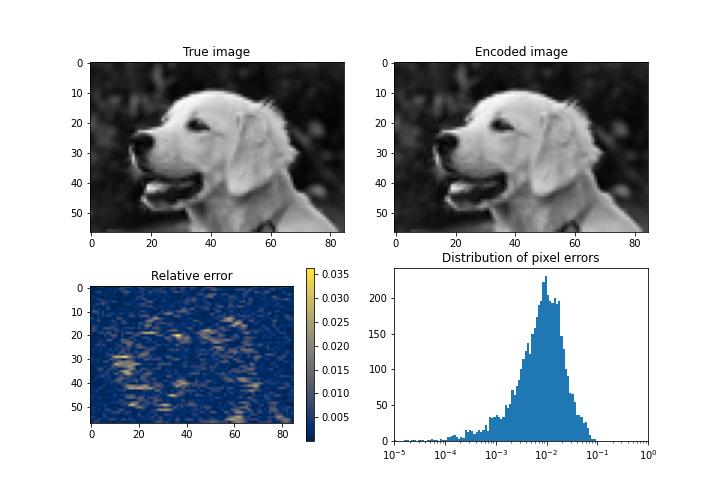

# SIREN in Flax

Unofficial implementation of [SIREN neural networks](https://arxiv.org/pdf/2006.09661.pdf) in [Flax](https://flax.readthedocs.io/en/latest/index.html), using the [Linen Module system](https://github.com/google/flax/blob/master/flax/linen/README.md).

## Examples

An image fitting problem is provided in the [Example notebook](Example.ipynb)

<div align="center">
</img>
</div>


### Defining a single SIREN layer

Returns a fully connected layer with sinusoidal activation function,  initialized according to [the original SIREN paper](https://arxiv.org/pdf/2006.09661.pdf).

```python
layer = SirenLayer(
    features = 32
    w0 = 1.0
    c = 6.0
    is_first = False
    use_bias = True
    act = jnp.sin
    precision = None
    dtype = jnp.float32
)
```

### How to use a SIREN neural network

```python
SirenNN = Siren(hidden_dim=512, output_dim=1, final_activation=sigmoid)
params = SirenNN.init(random_key, sample_input)["params"]
output = SirenNN.apply({"params": params}, sample_input)
```

### Approximate image on a grid

This can be easily done using the built-in broadcasting features of `jax.numpy` functions. This repository provides an useful initialized `grid_init` to generate a coordinate grid that can be used as input.
```python
SirenDef = Siren(num_layers=5)

grid = grid_init(grid_dimension, jnp.float32)()
params = SirenDef.init(key, grid)["params"]

image = SirenDef.apply({"params": params}, grid)
```

## Related works

- [`siren-jax`](https://github.com/KeunwooPark/siren-jax)
- [`siren-pytorch`](https://github.com/lucidrains/siren-pytorch)